# Entity Relationship Diagram (ERD)
# Sistem Manajemen Bengkel Ban

## Deskripsi Database
Database sistem manajemen bengkel ban dengan support multi-language (EN/JA), autentikasi berbasis Sanctum, dan fitur lengkap untuk reservasi, penyimpanan ban, inquiry, dan manajemen konten.

```plantuml
@startuml
!theme plain
skinparam linetype ortho
skinparam backgroundColor #FEFEFE

' Users & Authentication
entity "users" as users {
  * id : BIGINT <<PK>>
  --
  * full_name : VARCHAR(255)
  full_name_kana : VARCHAR(255)
  * email : VARCHAR(255) <<UNIQUE>>
  email_verified_at : TIMESTAMP
  * password : VARCHAR(255)
  * phone_number : VARCHAR(20)
  gender : ENUM(male,female,other)
  date_of_birth : DATE
  company_name : VARCHAR(255)
  department : VARCHAR(100)
  home_address : TEXT
  company_address : TEXT
  * role : ENUM(admin,customer)
  is_active : BOOLEAN
  remember_token : VARCHAR(100)
  * created_at : TIMESTAMP
  * updated_at : TIMESTAMP
}

entity "personal_access_tokens" as tokens {
  * id : BIGINT <<PK>>
  * tokenable_type : VARCHAR(255)
  * tokenable_id : BIGINT
  * name : VARCHAR(255)
  * token : VARCHAR(64) <<UNIQUE>>
  abilities : TEXT
  last_used_at : TIMESTAMP
  expires_at : TIMESTAMP
  * created_at : TIMESTAMP
  * updated_at : TIMESTAMP
}

entity "password_reset_tokens" as password_resets {
  * email : VARCHAR(255) <<PK>>
  * token : VARCHAR(255)
  * created_at : TIMESTAMP
}

' Menus/Services
entity "menus" as menus {
  * id : BIGINT <<PK>>
  * required_time : INTEGER
  * price : DECIMAL(10,2)
  photo_path : VARCHAR(255)
  display_order : INTEGER
  * is_active : BOOLEAN
  color : VARCHAR(7)
  * created_at : TIMESTAMP
  * updated_at : TIMESTAMP
}

entity "menu_translations" as menu_translations {
  * id : BIGINT <<PK>>
  * menu_id : BIGINT <<FK>>
  * locale : VARCHAR(5)
  * name : VARCHAR(255)
  description : TEXT
  * created_at : TIMESTAMP
  * updated_at : TIMESTAMP
  --
  <<UNIQUE(menu_id, locale)>>
}

' Reservations
entity "reservations" as reservations {
  * id : BIGINT <<PK>>
  user_id : BIGINT <<FK>>
  * menu_id : BIGINT <<FK>>
  * reservation_datetime : TIMESTAMP
  number_of_people : INTEGER
  * amount : DECIMAL(10,2)
  * status : ENUM(pending,confirmed,cancelled,completed)
  cancellation_reason : TEXT
  * payment_status : ENUM(unpaid,paid,refunded)
  notes : TEXT
  guest_full_name : VARCHAR(255)
  guest_email : VARCHAR(255)
  guest_phone_number : VARCHAR(20)
  * created_at : TIMESTAMP
  * updated_at : TIMESTAMP
}

' Tire Storage
entity "tire_storages" as tire_storages {
  * id : BIGINT <<PK>>
  * user_id : BIGINT <<FK>>
  * tire_type : VARCHAR(100)
  * tire_size : VARCHAR(50)
  * quantity : INTEGER
  * storage_location : VARCHAR(100)
  start_date : DATE
  end_date : DATE
  * status : ENUM(active,completed,cancelled)
  notes : TEXT
  * created_at : TIMESTAMP
  * updated_at : TIMESTAMP
}

' Contacts/Inquiries
entity "contacts" as contacts {
  * id : BIGINT <<PK>>
  * full_name : VARCHAR(255)
  * email : VARCHAR(255)
  * phone_number : VARCHAR(20)
  * subject : VARCHAR(255)
  * message : TEXT
  * status : ENUM(new,in_progress,resolved,closed)
  admin_reply : TEXT
  replied_at : TIMESTAMP
  replied_by : BIGINT <<FK>>
  * created_at : TIMESTAMP
  * updated_at : TIMESTAMP
}

' Questionnaires
entity "questionnaires" as questionnaires {
  * id : BIGINT <<PK>>
  * question_type : ENUM(text,radio,checkbox,textarea)
  * is_required : BOOLEAN
  display_order : INTEGER
  * is_active : BOOLEAN
  * created_at : TIMESTAMP
  * updated_at : TIMESTAMP
}

entity "questionnaire_translations" as questionnaire_translations {
  * id : BIGINT <<PK>>
  * questionnaire_id : BIGINT <<FK>>
  * locale : VARCHAR(5)
  * question_text : TEXT
  options : JSON
  * created_at : TIMESTAMP
  * updated_at : TIMESTAMP
  --
  <<UNIQUE(questionnaire_id, locale)>>
}

entity "questionnaire_responses" as questionnaire_responses {
  * id : BIGINT <<PK>>
  * reservation_id : BIGINT <<FK>>
  * questionnaire_id : BIGINT <<FK>>
  * response : TEXT
  * created_at : TIMESTAMP
  * updated_at : TIMESTAMP
}

' FAQs
entity "faqs" as faqs {
  * id : BIGINT <<PK>>
  * category : VARCHAR(100)
  display_order : INTEGER
  * is_active : BOOLEAN
  * created_at : TIMESTAMP
  * updated_at : TIMESTAMP
}

entity "faq_translations" as faq_translations {
  * id : BIGINT <<PK>>
  * faq_id : BIGINT <<FK>>
  * locale : VARCHAR(5)
  * question : TEXT
  * answer : TEXT
  * created_at : TIMESTAMP
  * updated_at : TIMESTAMP
  --
  <<UNIQUE(faq_id, locale)>>
}

' Announcements
entity "announcements" as announcements {
  * id : BIGINT <<PK>>
  * priority : ENUM(low,normal,high,urgent)
  * is_active : BOOLEAN
  published_at : TIMESTAMP
  expires_at : TIMESTAMP
  * created_at : TIMESTAMP
  * updated_at : TIMESTAMP
}

entity "announcement_translations" as announcement_translations {
  * id : BIGINT <<PK>>
  * announcement_id : BIGINT <<FK>>
  * locale : VARCHAR(5)
  * title : VARCHAR(255)
  * content : TEXT
  * created_at : TIMESTAMP
  * updated_at : TIMESTAMP
  --
  <<UNIQUE(announcement_id, locale)>>
}

' Blocked Periods
entity "blocked_periods" as blocked_periods {
  * id : BIGINT <<PK>>
  * start_datetime : TIMESTAMP
  * end_datetime : TIMESTAMP
  menu_id : BIGINT <<FK>>
  * is_all_day : BOOLEAN
  * created_at : TIMESTAMP
  * updated_at : TIMESTAMP
}

entity "blocked_period_translations" as blocked_period_translations {
  * id : BIGINT <<PK>>
  * blocked_period_id : BIGINT <<FK>>
  * locale : VARCHAR(5)
  * reason : TEXT
  * created_at : TIMESTAMP
  * updated_at : TIMESTAMP
  --
  <<UNIQUE(blocked_period_id, locale)>>
}

' Business Settings
entity "business_settings" as business_settings {
  * id : BIGINT <<PK>>
  phone_number : VARCHAR(20)
  business_hours : JSON
  website_url : VARCHAR(255)
  top_image_path : VARCHAR(255)
  * site_public : BOOLEAN
  reply_email : VARCHAR(255)
  google_analytics_id : VARCHAR(50)
  * created_at : TIMESTAMP
  * updated_at : TIMESTAMP
}

entity "business_setting_translations" as business_setting_translations {
  * id : BIGINT <<PK>>
  * business_setting_id : BIGINT <<FK>>
  * locale : VARCHAR(5)
  shop_name : VARCHAR(255)
  address : TEXT
  access_information : TEXT
  site_name : VARCHAR(255)
  shop_description : TEXT
  terms_of_use : TEXT
  privacy_policy : TEXT
  * created_at : TIMESTAMP
  * updated_at : TIMESTAMP
  --
  <<UNIQUE(business_setting_id, locale)>>
}

' Relationships

' Users & Tokens
users ||--o{ tokens : "has many"
users ||--o{ password_resets : "has"

' Menus & Translations
menus ||--o{ menu_translations : "has translations"

' Reservations
users ||--o{ reservations : "creates"
menus ||--o{ reservations : "reserved in"
reservations ||--o{ questionnaire_responses : "has responses"

' Tire Storage
users ||--o{ tire_storages : "owns"

' Contacts
users ||--o{ contacts : "replied by (admin)"

' Questionnaires
questionnaires ||--o{ questionnaire_translations : "has translations"
questionnaires ||--o{ questionnaire_responses : "answered in"

' FAQs
faqs ||--o{ faq_translations : "has translations"

' Announcements
announcements ||--o{ announcement_translations : "has translations"

' Blocked Periods
menus ||--o{ blocked_periods : "blocked for"
blocked_periods ||--o{ blocked_period_translations : "has translations"

' Business Settings
business_settings ||--o{ business_setting_translations : "has translations"

note right of users
  **Users Table**
  - Admin & Customer roles
  - Sanctum authentication
  - Complete profile info
  - Japanese name support (kana)
end note

note right of reservations
  **Reservations**
  - Support guest & registered users
  - Guest info stored in reservation
  - Status workflow: 
    pending → confirmed → completed
  - Payment tracking
  - Linked to questionnaire responses
end note

note right of menus
  **Multi-language Support**
  All content tables have 
  translation tables:
  - menu_translations
  - faq_translations
  - questionnaire_translations
  - announcement_translations
  - blocked_period_translations
  - business_setting_translations
  
  Locales: en, ja
end note

note right of tire_storages
  **Tire Storage**
  - Track customer tire storage
  - Location management
  - Date range tracking
  - Status: active/completed/cancelled
end note

note bottom of blocked_periods
  **Blocked Periods**
  - Can block specific menu
  - Or block all menus (menu_id=null)
  - Support all-day or time-range
  - Prevent reservations
end note

note bottom of business_settings
  **Business Settings**
  - Singleton pattern (1 row only)
  - Business hours in JSON
  - Site-wide configuration
  - Multi-language content
end note

@enduml
```



---

# DOKUMENTASI DATABASE

---

## 📊 Tabel Utama

### 1. **users** - User & Authentication
**Purpose**: Menyimpan data user (Admin & Customer)

**Kolom Penting**:
- `role`: ENUM('admin', 'customer')
- `email`: Unique, untuk login
- `full_name_kana`: Support Japanese name
- `is_active`: Soft disable user

**Indexes**:
- PRIMARY KEY: `id`
- UNIQUE: `email`
- INDEX: `role`, `is_active`

---

### 2. **personal_access_tokens** - Sanctum Tokens
**Purpose**: Laravel Sanctum authentication tokens

**Polymorphic Relation**:
- `tokenable_type`: 'App\Models\User'
- `tokenable_id`: user_id

---

### 3. **menus** - Services/Menu Items
**Purpose**: Master data layanan bengkel

**Kolom Penting**:
- `required_time`: Durasi layanan (menit)
- `price`: Harga layanan
- `display_order`: Urutan tampilan
- `is_active`: Status aktif/nonaktif
- `color`: Hex color untuk calendar

**Translation Support**: ✅ (menu_translations)

---

### 4. **reservations** - Booking Records
**Purpose**: Data reservasi customer

**Support**:
- ✅ Registered user (user_id)
- ✅ Guest user (guest_* fields)

**Status Flow**:
```
pending → confirmed → completed
   ↓
cancelled
```

**Payment Status**:
- unpaid
- paid
- refunded

**Indexes**:
- `user_id`, `menu_id`
- `reservation_datetime`
- `status`, `payment_status`

---

### 5. **tire_storages** - Tire Storage Records
**Purpose**: Pencatatan penyimpanan ban customer

**Kolom Penting**:
- `tire_type`: Jenis ban
- `tire_size`: Ukuran ban
- `quantity`: Jumlah ban
- `storage_location`: Lokasi penyimpanan
- `start_date`, `end_date`: Periode penyimpanan
- `status`: active/completed/cancelled

---

### 6. **contacts** - Customer Inquiries
**Purpose**: Pertanyaan/kontak dari customer atau guest

**Features**:
- ✅ Track status (new → in_progress → resolved → closed)
- ✅ Admin reply support
- ✅ Track who replied (replied_by → users.id)
- ✅ Timestamp kapan dibalas

---

### 7. **questionnaires** - Dynamic Forms
**Purpose**: Kuesioner dinamis untuk reservasi

**Question Types**:
- text
- radio
- checkbox
- textarea

**Features**:
- ✅ Multi-language (questionnaire_translations)
- ✅ Display order
- ✅ Required/Optional
- ✅ Active/Inactive
- ✅ JSON options untuk pilihan

---

### 8. **questionnaire_responses** - Form Answers
**Purpose**: Jawaban customer atas kuesioner

**Relations**:
- Linked to `reservations`
- Linked to `questionnaires`

---

### 9. **faqs** - Frequently Asked Questions
**Purpose**: FAQ untuk customer

**Features**:
- ✅ Multi-language (faq_translations)
- ✅ Category grouping
- ✅ Display order
- ✅ Active/Inactive status

---

### 10. **announcements** - Site Announcements
**Purpose**: Pengumuman/berita untuk customer

**Priority Levels**:
- low
- normal
- high
- urgent

**Features**:
- ✅ Multi-language (announcement_translations)
- ✅ Published date
- ✅ Expiration date
- ✅ Active/Inactive

---

### 11. **blocked_periods** - Unavailable Times
**Purpose**: Block waktu tertentu dari reservasi

**Block Scope**:
- Specific menu (menu_id)
- All menus (menu_id = NULL)

**Features**:
- ✅ Date & time range
- ✅ All-day blocking
- ✅ Multi-language reason (blocked_period_translations)
- ✅ Prevent overlapping reservations

---

### 12. **business_settings** - Site Configuration
**Purpose**: Pengaturan umum bisnis (Singleton)

**Kolom Penting**:
- `business_hours`: JSON (jam operasional per hari)
- `site_public`: Public/Private site
- `top_image_path`: Hero image
- `google_analytics_id`: Tracking

**Translation Fields** (business_setting_translations):
- shop_name
- address
- access_information
- site_name
- shop_description
- terms_of_use
- privacy_policy

---

## 🌐 Multi-language Support

### Translation Tables Pattern
Setiap konten yang perlu multi-bahasa memiliki translation table:

**Structure**:
```
{entity}_translations
  - id (PK)
  - {entity}_id (FK)
  - locale (en/ja)
  - {translatable_fields}
  - created_at, updated_at
  - UNIQUE(entity_id, locale)
```

**Supported Locales**:
- `en`: English
- `ja`: Japanese (日本語)

**Translation Tables**:
1. menu_translations
2. questionnaire_translations
3. faq_translations
4. announcement_translations
5. blocked_period_translations
6. business_setting_translations

---

## 🔑 Key Relationships

### 1. **User Relationships**
- User → Reservations (1:N)
- User → Tire Storages (1:N)
- User → Tokens (1:N)
- User (Admin) → Contact Replies (1:N)

### 2. **Menu Relationships**
- Menu → Reservations (1:N)
- Menu → Blocked Periods (1:N)
- Menu → Translations (1:N)

### 3. **Reservation Relationships**
- Reservation → User (N:1) [Optional - guest support]
- Reservation → Menu (N:1)
- Reservation → Questionnaire Responses (1:N)

### 4. **Questionnaire Flow**
- Questionnaire → Translations (1:N)
- Questionnaire → Responses (1:N)
- Response → Reservation (N:1)

---

## 📈 Database Statistics

**Total Tables**: 18 tables
- Master Data: 6 tables
- Translation: 6 tables
- Transaction: 4 tables
- Auth/Config: 3 tables

**Multi-language Support**: 6 entities
**Supported Locales**: 2 (EN, JA)

---

## 🔒 Data Integrity

### Foreign Key Constraints
- ✅ All FK relationships enforced
- ✅ CASCADE on update
- ✅ RESTRICT on delete (untuk data transaksional)
- ✅ SET NULL untuk optional relations

### Unique Constraints
- ✅ `users.email`
- ✅ `{entity}_translations(entity_id, locale)`
- ✅ `personal_access_tokens.token`

### Indexes for Performance
- ✅ All FK columns indexed
- ✅ Status fields indexed
- ✅ Date/datetime fields indexed
- ✅ Email fields indexed

---

## 🎯 Business Rules

### Reservations
1. Guest atau registered user (XOR logic)
2. Tidak boleh overlap dengan blocked_periods
3. Harus dalam business_hours
4. Menu harus active
5. Status workflow enforced

### Tire Storage
1. Harus registered user
2. End date >= start date
3. Quantity > 0

### Contacts
1. Guest atau registered user bisa submit
2. Hanya admin bisa reply
3. Status workflow tracked

### Blocked Periods
1. Start < End datetime
2. Jika menu_id NULL → block all menus
3. Prevent reservation creation

---

## 🚀 Scalability Considerations

### Partitioning Strategy
- `reservations`: Partition by year (reservation_datetime)
- `questionnaire_responses`: Partition by year (created_at)

### Archiving Strategy
- Archive old reservations (>2 years)
- Archive completed tire_storages (>1 year)
- Archive resolved contacts (>6 months)

### Caching Strategy
- Cache `business_settings` (rarely changes)
- Cache active `menus` with translations
- Cache active `faqs` with translations
- Cache `blocked_periods` (current month)

---

## 📝 Notes

### Guest vs Registered Users
**Reservations Table**:
- `user_id`: NULL untuk guest, filled untuk registered
- `guest_*` fields: Filled untuk guest, NULL untuk registered

**Customer Identification**:
- Registered: Use `user_id`
- Guest: Use synthetic ID `guest_{reservation_id}`

### Singleton Tables
- `business_settings`: Hanya 1 row (id=1)

### Soft Deletes
- Tidak menggunakan soft deletes
- Data historis preserved (reservasi, responses, dll)
- Users di-disable via `is_active` field

---

## Kesimpulan

Database dirancang dengan prinsip:
- ✅ **Normalization**: 3NF compliance
- ✅ **Multi-language**: Flexible translation support
- ✅ **Scalability**: Partitioning & archiving ready
- ✅ **Data Integrity**: FK constraints & validations
- ✅ **Performance**: Strategic indexing
- ✅ **Flexibility**: Support guest & registered users
- ✅ **Audit Trail**: Timestamps on all tables

**Total Entities**: 12 main entities
**Total Tables**: 18 tables (including translations)
**Localization**: Full EN/JA support
