# Use Case Diagram - Admin (Administrator)

## Deskripsi Aktor
**Admin** adalah pengelola sistem dengan akses penuh ke semua fitur manajemen. Admin bertanggung jawab untuk mengelola data master, konfirmasi reservasi, monitoring operasional, dan konfigurasi sistem.

```plantuml
@startuml
!theme plain
skinparam packageStyle rectangle
skinparam backgroundColor #FEFEFE

actor "Administrator\n(Admin)" as Admin

rectangle "Sistem Manajemen Bengkel Ban - Admin Panel" {
  
  package "Manajemen Pengguna" #LightBlue {
    usecase "Lihat Daftar User\n(List Users)" as UC1
    usecase "Cari User\n(Search Users)" as UC2
    usecase "Filter by Role\n(Filter Users)" as UC3
    usecase "Tambah User Baru\n(Create User)" as UC4
    usecase "Edit User\n(Update User)" as UC5
    usecase "Hapus User\n(Delete User)" as UC6
    usecase "Reset Password User\n(Reset Password)" as UC7
  }
  
  package "Manajemen Menu/Layanan" #LightGreen {
    usecase "Lihat Daftar Menu\n(List Menus)" as UC8
    usecase "Tambah Menu Baru\n(Create Menu)" as UC9
    usecase "Edit Menu\n(Update Menu)" as UC10
    usecase "Hapus Menu\n(Delete Menu)" as UC11
    usecase "Toggle Status Menu\n(Activate/Deactivate)" as UC12
    usecase "Reorder Menu\n(Change Order)" as UC13
    usecase "Bulk Update Status\n(Bulk Operations)" as UC14
    usecase "Lihat Statistik Menu\n(Menu Statistics)" as UC15
    usecase "Hitung Waktu Selesai\n(Calculate End Time)" as UC16
  }
  
  package "Manajemen Reservasi" #LightYellow {
    usecase "Lihat Daftar Reservasi\n(List Reservations)" as UC17
    usecase "Lihat Kalender Reservasi\n(Calendar View)" as UC18
    usecase "Lihat Detail Reservasi\n(View Details)" as UC19
    usecase "Buat Reservasi\n(Create Reservation)" as UC20
    usecase "Edit Reservasi\n(Update Reservation)" as UC21
    usecase "Konfirmasi Reservasi\n(Confirm)" as UC22
    usecase "Batalkan Reservasi\n(Cancel)" as UC23
    usecase "Selesaikan Reservasi\n(Complete)" as UC24
    usecase "Bulk Update Status\n(Bulk Status)" as UC25
    usecase "Cek Ketersediaan\n(Check Availability)" as UC26
    usecase "Lihat Statistik\n(Statistics)" as UC27
    usecase "Export Data\n(Export)" as UC28
  }
  
  package "Manajemen Customer" #LightPink {
    usecase "Lihat Daftar Customer\n(List Customers)" as UC29
    usecase "Lihat Detail Customer\n(Customer Details)" as UC30
    usecase "Cari Customer\n(Search)" as UC31
    usecase "Filter Customer\n(Filter by Type)" as UC32
    usecase "Lihat Statistik Customer\n(Customer Stats)" as UC33
    usecase "Export Data Customer\n(Export)" as UC34
  }
  
  package "Manajemen Penyimpanan Ban" #LightCyan {
    usecase "Lihat Daftar Storage\n(List Storage)" as UC35
    usecase "Tambah Storage Baru\n(Create)" as UC36
    usecase "Edit Storage\n(Update)" as UC37
    usecase "Akhiri Penyimpanan\n(End Storage)" as UC38
    usecase "Bulk End Storage\n(Bulk End)" as UC39
    usecase "Hapus Storage\n(Delete)" as UC40
  }
  
  package "Manajemen Kontak/Inquiry" #Lavender {
    usecase "Lihat Daftar Kontak\n(List Contacts)" as UC41
    usecase "Lihat Detail Kontak\n(View Details)" as UC42
    usecase "Balas Pertanyaan\n(Reply Inquiry)" as UC43
    usecase "Update Status\n(Update Status)" as UC44
    usecase "Cari Kontak\n(Search)" as UC45
    usecase "Filter Kontak\n(Filter)" as UC46
  }
  
  package "Pengaturan Bisnis" #LightGoldenRodYellow {
    usecase "Lihat Pengaturan\n(View Settings)" as UC47
    usecase "Update Pengaturan\n(Update Settings)" as UC48
    usecase "Kelola Jam Operasional\n(Business Hours)" as UC49
    usecase "Upload Gambar Utama\n(Upload Image)" as UC50
    usecase "Update Konten Lokal\n(Locale Content)" as UC51
  }
  
  package "Manajemen Konten" #MistyRose {
    usecase "Kelola Pengumuman\n(Announcements)" as UC52
    usecase "Kelola FAQ\n(FAQs)" as UC53
    usecase "Kelola Kuesioner\n(Questionnaires)" as UC54
    usecase "Kelola Periode Libur\n(Blocked Periods)" as UC55
  }
  
  package "Manajemen Pembayaran" #Honeydew {
    usecase "Lihat Daftar Pembayaran\n(List Payments)" as UC56
    usecase "Update Status Bayar\n(Update Status)" as UC57
    usecase "Rekonsiliasi\n(Reconciliation)" as UC58
    usecase "Laporan Keuangan\n(Financial Report)" as UC59
  }
  
  package "Dashboard & Laporan" #AliceBlue {
    usecase "Lihat Dashboard\n(View Dashboard)" as UC60
    usecase "Statistik Hari Ini\n(Today Stats)" as UC61
    usecase "Laporan Bulanan\n(Monthly Report)" as UC62
    usecase "Analitik Trend\n(Analytics)" as UC63
    usecase "Export Laporan\n(Export)" as UC64
  }
}

' Admin relationships - User Management
Admin --> UC1
Admin --> UC2
Admin --> UC3
Admin --> UC4
Admin --> UC5
Admin --> UC6
Admin --> UC7

' Menu Management
Admin --> UC8
Admin --> UC9
Admin --> UC10
Admin --> UC11
Admin --> UC12
Admin --> UC13
Admin --> UC14
Admin --> UC15
Admin --> UC16

' Reservation Management
Admin --> UC17
Admin --> UC18
Admin --> UC19
Admin --> UC20
Admin --> UC21
Admin --> UC22
Admin --> UC23
Admin --> UC24
Admin --> UC25
Admin --> UC26
Admin --> UC27
Admin --> UC28

' Customer Management
Admin --> UC29
Admin --> UC30
Admin --> UC31
Admin --> UC32
Admin --> UC33
Admin --> UC34

' Storage Management
Admin --> UC35
Admin --> UC36
Admin --> UC37
Admin --> UC38
Admin --> UC39
Admin --> UC40

' Contact Management
Admin --> UC41
Admin --> UC42
Admin --> UC43
Admin --> UC44
Admin --> UC45
Admin --> UC46

' Business Settings
Admin --> UC47
Admin --> UC48
Admin --> UC49
Admin --> UC50
Admin --> UC51

' Content Management
Admin --> UC52
Admin --> UC53
Admin --> UC54
Admin --> UC55

' Payment Management
Admin --> UC56
Admin --> UC57
Admin --> UC58
Admin --> UC59

' Dashboard & Reports
Admin --> UC60
Admin --> UC61
Admin --> UC62
Admin --> UC63
Admin --> UC64

' Include relationships
UC20 ..> UC26 : <<include>>
UC22 ..> UC26 : <<include>>
UC17 ..> UC18 : <<extend>>
UC29 ..> UC30 : <<extend>>
UC41 ..> UC42 : <<extend>>

note right of Admin
  Admin memiliki akses penuh:
  - Kelola semua data master
  - Konfirmasi reservasi
  - Monitor operasional
  - Konfigurasi sistem
  - Lihat laporan & statistik
  - Export data
end note

note bottom of UC18
  Calendar View menampilkan:
  - Reservasi per hari/minggu/bulan
  - Blocked periods
  - Kapasitas tersedia
  - Color coding by status
end note

note bottom of UC32
  Tipe Customer:
  - First-time (1 reservasi)
  - Repeat (≥3 reservasi)
  - Dormant (>3 bulan tidak aktif)
end note

@enduml
```



---

# DOKUMENTASI LENGKAP USE CASE ADMIN

---

## 👥 MANAJEMEN PENGGUNA

### UC1: Lihat Daftar User
**Endpoint**: `GET /api/v1/admin/users`

**Query Parameters**:
```
?per_page=15
&cursor=eyJpZCI6MX0
&role=admin|customer
&search=keyword
```

**Response**:
```json
{
  "data": [
    {
      "id": "1",
      "full_name": "Admin User",
      "email": "admin@example.com",
      "phone_number": "081234567890",
      "role": "admin",
      "email_verified": true,
      "is_active": true,
      "created_at": "2025-01-01",
      "last_login": "2025-10-29"
    }
  ],
  "cursor": {...}
}
```

**Fitur**:
- ✅ Pagination dengan cursor
- ✅ Search by name, email, phone
- ✅ Filter by role
- ✅ Sort by various fields

---

### UC2: Cari User
**Endpoint**: `GET /api/v1/admin/users/search?search=keyword`

**Search Scope**:
- Nama lengkap
- Email
- Nomor telepon
- Nama perusahaan

---

### UC3: Filter by Role
**Endpoints**:
- `GET /api/v1/admin/users/customers` - Customer saja
- `GET /api/v1/admin/users/admins` - Admin saja
- `GET /api/v1/admin/users/role/{role}` - Filter by role tertentu

---

### UC4: Tambah User Baru
**Endpoint**: `POST /api/v1/admin/users`

**Request**:
```json
{
  "full_name": "User Baru",
  "full_name_kana": "ユーザーあたらしい",
  "email": "newuser@example.com",
  "phone_number": "081234567890",
  "password": "password123",
  "role": "customer|admin",
  "gender": "male|female|other",
  "date_of_birth": "1990-01-01",
  "company_name": "PT Example",
  "department": "IT",
  "home_address": "Alamat lengkap",
  "company_address": "Alamat kantor"
}
```

**Validasi**:
- Email harus unik
- Password minimal 8 karakter
- Role harus valid
- Semua field wajib kecuali opsional

---

### UC5: Edit User
**Endpoint**: `PUT /api/v1/admin/users/{id}`

**Request**: (sama seperti UC4, tapi semua field opsional)

---

### UC6: Hapus User
**Endpoint**: `DELETE /api/v1/admin/users/{id}`

**Konfirmasi Required**: Yes

**Dampak**:
- User tidak bisa login
- Data historis tetap tersimpan
- Reservasi masa lalu tetap ada (dianonimkan)

---

### UC7: Reset Password User
**Endpoint**: `PATCH /api/v1/admin/users/{id}/reset-password`

**Request**:
```json
{
  "new_password": "newpassword123",
  "send_email": true
}
```

**Proses**:
1. Admin reset password
2. Sistem generate password baru (atau gunakan yang diberikan)
3. Kirim email ke user (jika send_email=true)
4. User bisa login dengan password baru

---

## 🍽️ MANAJEMEN MENU/LAYANAN

### UC8: Lihat Daftar Menu
**Endpoint**: `GET /api/v1/admin/menus`

**Query Parameters**:
```
?per_page=15
&cursor=...
&is_active=true|false
&search=keyword
&locale=en|ja
```

**Response**:
```json
{
  "data": [
    {
      "id": 1,
      "name": "Ganti Ban",
      "description": "Layanan penggantian ban",
      "required_time": 30,
      "price": "150000.00",
      "photo_path": "menus/tire-change.jpg",
      "display_order": 1,
      "is_active": true,
      "color": "#FF5733",
      "created_at": "2025-01-01",
      "translations": {
        "en": {...},
        "ja": {...}
      }
    }
  ]
}
```

---

### UC9: Tambah Menu Baru
**Endpoint**: `POST /api/v1/admin/menus`

**Request**:
```json
{
  "name": "Nama Layanan",
  "description": "Deskripsi lengkap",
  "required_time": 30,
  "price": "150000.00",
  "photo": "file_upload",
  "display_order": 1,
  "is_active": true,
  "color": "#FF5733",
  "translations": {
    "en": {
      "name": "Service Name",
      "description": "Full description"
    },
    "ja": {
      "name": "サービス名",
      "description": "完全な説明"
    }
  }
}
```

**Validasi**:
- Name wajib diisi
- Required time > 0
- Price >= 0
- Color format hex valid
- Photo: image, max 2MB

---

### UC10: Edit Menu
**Endpoint**: `PUT /api/v1/admin/menus/{id}`

**Request**: (sama seperti UC9)

---

### UC11: Hapus Menu
**Endpoint**: `DELETE /api/v1/admin/menus/{id}`

**Validasi**:
- Tidak boleh ada reservasi aktif
- Konfirmasi required

---

### UC12: Toggle Status Menu
**Endpoint**: `PATCH /api/v1/admin/menus/{id}/toggle-status`

**Efek**:
- Jika active → inactive: Menu tidak bisa dibooking
- Jika inactive → active: Menu bisa dibooking lagi

---

### UC13: Reorder Menu
**Endpoint**: `POST /api/v1/admin/menus/reorder`

**Request**:
```json
{
  "orders": [
    {"id": 1, "display_order": 1},
    {"id": 2, "display_order": 2},
    {"id": 3, "display_order": 3}
  ]
}
```

**Guna**: Mengurutkan tampilan menu di customer side

---

### UC14: Bulk Update Status
**Endpoint**: `PATCH /api/v1/admin/menus/bulk-update-status`

**Request**:
```json
{
  "menu_ids": [1, 2, 3],
  "is_active": false
}
```

**Use Case**: Nonaktifkan banyak menu sekaligus (misal saat libur)

---

### UC15: Lihat Statistik Menu
**Endpoint**: `GET /api/v1/admin/menus/statistics`

**Response**:
```json
{
  "total_menus": 10,
  "active_menus": 8,
  "inactive_menus": 2,
  "most_popular": {
    "id": 1,
    "name": "Ganti Ban",
    "booking_count": 150
  },
  "revenue_by_menu": [...]
}
```

---

### UC16: Hitung Waktu Selesai
**Endpoint**: `POST /api/v1/admin/menus/calculate-end-time`

**Request**:
```json
{
  "menu_id": 1,
  "start_time": "2025-11-01 10:00:00"
}
```

**Response**:
```json
{
  "start_time": "2025-11-01 10:00:00",
  "end_time": "2025-11-01 10:30:00",
  "duration_minutes": 30
}
```

---

## 📅 MANAJEMEN RESERVASI

### UC17: Lihat Daftar Reservasi
**Endpoint**: `GET /api/v1/admin/reservations/list`

**Query Parameters**:
```
?per_page=15
&cursor=...
&status=pending|confirmed|cancelled|completed
&start_date=2025-01-01
&end_date=2025-12-31
&menu_id=1
&customer_id=1
&search=keyword
```

**Response**: Daftar reservasi dengan info lengkap

---

### UC18: Lihat Kalender Reservasi
**Endpoint**: `GET /api/v1/admin/reservations/calendar`

**Query Parameters**:
```
?start=2025-11-01
&end=2025-11-30
&view=month|week|day
```

**Response**:
```json
{
  "events": [
    {
      "id": 1,
      "title": "Ganti Ban - Budi",
      "start": "2025-11-01T10:00:00",
      "end": "2025-11-01T10:30:00",
      "color": "#28a745",
      "status": "confirmed",
      "menu": {...},
      "customer": {...}
    }
  ],
  "blocked_periods": [...],
  "business_hours": {...}
}
```

**Fitur Calendar**:
- ✅ Drag & drop untuk reschedule
- ✅ Color coding by status
- ✅ Click event untuk detail
- ✅ Show blocked periods
- ✅ Show business hours

---

### UC19: Lihat Detail Reservasi
**Endpoint**: `GET /api/v1/admin/reservations/{id}`

**Response**: Detail lengkap reservasi termasuk:
- Info customer
- Info menu
- Waktu reservasi
- Status & history status
- Payment info
- Questionnaire responses
- Notes

---

### UC20: Buat Reservasi (Admin Create)
**Endpoint**: `POST /api/v1/admin/reservations`

**Request**:
```json
{
  "user_id": 1,
  "menu_id": 1,
  "reservation_datetime": "2025-11-01 10:00:00",
  "number_of_people": 1,
  "amount": "150000.00",
  "status": "confirmed",
  "notes": "Created by admin",
  "guest_info": {
    "full_name": "Guest Name",
    "email": "guest@example.com",
    "phone_number": "081234567890"
  }
}
```

**Catatan**:
- Admin bisa langsung set status "confirmed"
- Bisa create untuk registered user atau guest
- Bypass availability check (dengan peringatan)

---

### UC21: Edit Reservasi
**Endpoint**: `PUT /api/v1/admin/reservations/{id}`

**Request**: (sama seperti UC20)

**Admin dapat**:
- Ubah waktu reservasi
- Ubah menu
- Ubah status
- Tambah notes

---

### UC22: Konfirmasi Reservasi
**Endpoint**: `PATCH /api/v1/admin/reservations/{id}/confirm`

**Efek**:
- Status: pending → confirmed
- Kirim email konfirmasi ke customer
- Update calendar

---

### UC23: Batalkan Reservasi
**Endpoint**: `PATCH /api/v1/admin/reservations/{id}/cancel`

**Request**:
```json
{
  "cancellation_reason": "Alasan pembatalan",
  "send_notification": true
}
```

**Efek**:
- Status: * → cancelled
- Kirim email notifikasi
- Slot jadi available lagi

---

### UC24: Selesaikan Reservasi
**Endpoint**: `PATCH /api/v1/admin/reservations/{id}/complete`

**Request**:
```json
{
  "actual_end_time": "2025-11-01 10:35:00",
  "service_notes": "Catatan layanan",
  "payment_status": "paid"
}
```

**Efek**:
- Status: confirmed → completed
- Update payment
- Request feedback (via email)

---

### UC25: Bulk Update Status
**Endpoint**: `PATCH /api/v1/admin/reservations/bulk/status`

**Request**:
```json
{
  "reservation_ids": [1, 2, 3],
  "status": "confirmed",
  "send_notification": true
}
```

---

### UC26: Cek Ketersediaan
**Endpoint**: `POST /api/v1/admin/reservations/check-availability`

**Request**:
```json
{
  "menu_id": 1,
  "date": "2025-11-01",
  "time": "10:00"
}
```

**Response**: Available slots & alternatives

---

### UC27: Lihat Statistik Reservasi
**Endpoint**: `GET /api/v1/admin/reservations/statistics`

**Response**:
```json
{
  "today": {
    "total": 10,
    "confirmed": 7,
    "pending": 2,
    "completed": 1
  },
  "this_week": {...},
  "this_month": {...},
  "revenue": {
    "today": "1500000",
    "week": "8500000",
    "month": "35000000"
  },
  "popular_menus": [...]
}
```

---

### UC28: Export Data Reservasi
**Endpoint**: `GET /api/v1/admin/reservations/export`

**Query Parameters**:
```
?format=csv|excel|pdf
&start_date=2025-01-01
&end_date=2025-12-31
&status=all
```

**Response**: Download file

---

## 👤 MANAJEMEN CUSTOMER

### UC29: Lihat Daftar Customer
**Endpoint**: `GET /api/v1/admin/customers`

**Query Parameters**:
```
?per_page=15
&cursor=...
&customer_type=first_time|repeat|dormant|all
&search=keyword
```

**Response**:
```json
{
  "data": [
    {
      "id": "1",
      "user_id": "1",
      "email": "customer@example.com",
      "full_name": "Customer Name",
      "phone_number": "081234567890",
      "is_registered": 1,
      "reservation_count": 5,
      "latest_reservation": "2025-11-01",
      "total_amount": "750000.00",
      "customer_type": "repeat"
    }
  ]
}
```

**Customer ID Format**:
- Registered: `"1"`, `"9"` (user_id)
- Guest: `"guest_17"` (guest_{reservation_id})

---

### UC30: Lihat Detail Customer
**Endpoint**: `GET /api/v1/admin/customers/{id}`

**Support**:
- Registered customer: `/customers/1`
- Guest customer: `/customers/guest_17`

**Response**:
```json
{
  "customer": {
    "customer_id": "1",
    "full_name": "Customer Name",
    "email": "customer@example.com",
    "phone_number": "081234567890",
    "is_registered": 1,
    "reservation_count": 5,
    "total_amount": "750000.00"
  },
  "reservation_history": [...],
  "tire_storage": [...],
  "stats": {
    "reservation_count": 5,
    "total_amount": "750000.00",
    "tire_storage_count": 2
  }
}
```

---

### UC31: Cari Customer
**Endpoint**: `GET /api/v1/admin/customers/search`

**Query**: `?search=keyword`

**Search by**:
- Nama
- Email
- Nomor telepon
- Nama perusahaan

---

### UC32: Filter Customer
**Endpoints**:
- `GET /api/v1/admin/customers?customer_type=first_time`
- `GET /api/v1/admin/customers?customer_type=repeat`
- `GET /api/v1/admin/customers?customer_type=dormant`

**Kriteria**:
- **First-time**: 1 reservasi
- **Repeat**: ≥3 reservasi
- **Dormant**: Tidak ada reservasi >3 bulan

---

### UC33: Lihat Statistik Customer
**Endpoint**: `GET /api/v1/admin/customers/statistics`

**Response**:
```json
{
  "statistics": {
    "first_time": 150,
    "repeat": 80,
    "dormant": 25
  },
  "total_customers": 255,
  "new_this_month": 15,
  "active_this_month": 95
}
```

---

### UC34: Export Data Customer
**Endpoint**: `GET /api/v1/admin/customers/export`

**Format**: CSV, Excel, PDF

---

## 🛞 MANAJEMEN PENYIMPANAN BAN

### UC35: Lihat Daftar Storage
**Endpoint**: `GET /api/v1/admin/storages`

**Response**: Daftar storage dengan status

---

### UC36: Tambah Storage Baru
**Endpoint**: `POST /api/v1/admin/storages`

---

### UC37: Edit Storage
**Endpoint**: `PUT /api/v1/admin/storages/{id}`

---

### UC38: Akhiri Penyimpanan
**Endpoint**: `PATCH /api/v1/admin/storages/{id}/end`

---

### UC39: Bulk End Storage
**Endpoint**: `PATCH /api/v1/admin/storages/bulk-end`

---

### UC40: Hapus Storage
**Endpoint**: `DELETE /api/v1/admin/storages/{id}`

---

## 💬 MANAJEMEN KONTAK/INQUIRY

### UC41-46: Contact Management
Endpoints tersedia untuk list, view, reply, update status, search, dan filter contacts.

**Endpoint**: `/api/v1/admin/contacts/*`

---

## ⚙️ PENGATURAN BISNIS

### UC47: Lihat Pengaturan
**Endpoint**: `GET /api/v1/admin/business-settings`

---

### UC48: Update Pengaturan
**Endpoint**: `PUT /api/v1/admin/business-settings`

**Request**:
```json
{
  "locale": "en|ja",
  "shop_name": "Nama Bengkel",
  "phone_number": "04-2937-5296",
  "address": "Alamat lengkap",
  "website_url": "https://fts.biz.id",
  "site_public": true,
  "reply_email": "info@tirepro.co.id",
  "google_analytics_id": "GA-XXXXXXXXX-X",
  "business_hours": {
    "monday": {"open": "09:00", "close": "18:00"},
    "sunday": {"closed": true}
  }
}
```

**Multi-language Support**:
- Parameter `locale` menentukan bahasa yang di-update
- Mendukung: `en` (English) dan `ja` (Japanese)

---

### UC49: Kelola Jam Operasional
**Endpoint**: `PATCH /api/v1/admin/business-settings/business-hours`

---

### UC50: Upload Gambar Utama
**Endpoint**: `POST /api/v1/admin/business-settings/top-image`

**Request**: Multipart form-data
- Field: `top_image`
- Format: JPEG, PNG, JPG, WebP
- Max size: 2MB

---

### UC51: Update Konten Lokal
**Endpoint**: `PUT /api/v1/admin/business-settings`

**Dengan parameter `locale`**:
- `locale=en`: Update konten English
- `locale=ja`: Update konten Japanese

---

## 📢 MANAJEMEN KONTEN

### UC52: Kelola Pengumuman
**Endpoints**: `/api/v1/admin/announcements/*`

### UC53: Kelola FAQ
**Endpoints**: `/api/v1/admin/faqs/*`

### UC54: Kelola Kuesioner
**Endpoints**: `/api/v1/admin/questionnaires/*`

### UC55: Kelola Periode Libur
**Endpoints**: `/api/v1/admin/blocked-periods/*`

**Fitur Blocked Periods**:
- ✅ Set tanggal & jam libur
- ✅ Block all menus atau specific menu
- ✅ Calendar integration
- ✅ Conflict detection
- ✅ Search & filter
- ✅ Statistics

---

## 💰 MANAJEMEN PEMBAYARAN

### UC56-59: Payment Management
**Endpoints**: `/api/v1/admin/payments/*`

---

## 📊 DASHBOARD & LAPORAN

### UC60: Lihat Dashboard
**Endpoint**: `GET /api/v1/admin/dashboard`

**Response**:
```json
{
  "today": {
    "reservations": 10,
    "revenue": "1500000",
    "new_customers": 3,
    "completed": 7
  },
  "upcoming_reservations": [...],
  "recent_activities": [...],
  "statistics": {
    "total_customers": 255,
    "total_revenue_month": "35000000",
    "popular_menu": "Ganti Ban"
  },
  "alerts": [...]
}
```

---

### UC61: Statistik Hari Ini
Real-time stats untuk operasional hari ini

---

### UC62: Laporan Bulanan
Comprehensive monthly report

---

### UC63: Analitik Trend
Trend analysis untuk business insight

---

### UC64: Export Laporan
Export berbagai laporan dalam format CSV/Excel/PDF

---

## 🔑 Fitur Khusus Admin

### 1. Bulk Operations
- Update status massal
- Delete massal
- Export massal

### 2. Advanced Filtering
- Multi-criteria filter
- Date range filter
- Custom filter builder

### 3. Real-time Monitoring
- Live reservation updates
- Real-time statistics
- Alert notifications

### 4. Multi-language Management
- Kelola konten EN/JA
- Translation interface
- Locale switching

### 5. Advanced Reporting
- Custom report builder
- Scheduled reports
- Export automation

---

## 🎯 Key Responsibilities

### Operational:
- ✅ Konfirmasi reservasi
- ✅ Kelola customer inquiries
- ✅ Monitor daily operations
- ✅ Handle cancellations

### Data Management:
- ✅ Maintain master data
- ✅ Update business settings
- ✅ Manage content
- ✅ Data cleanup

### Strategic:
- ✅ Analyze trends
- ✅ Monitor KPIs
- ✅ Generate reports
- ✅ Make business decisions

---

## 🔒 Security & Permissions

**Admin Access Control**:
- All endpoints require `auth:sanctum` + `admin` middleware
- Role-based access control
- Activity logging
- Audit trail

**Protected Actions**:
- Delete operations require confirmation
- Bulk operations have safety limits
- Critical changes are logged
- Sensitive data is masked

---

## Kesimpulan

Admin memiliki **kontrol penuh** terhadap:
- ✅ Semua data master
- ✅ Operasional harian
- ✅ Konfigurasi sistem
- ✅ Analitik & laporan
- ✅ Customer management
- ✅ Content management

**Total Use Cases**: 64 use cases
**Total Endpoints**: 100+ endpoints
**Multi-language**: EN/JA support
