# Use Case Diagram - Customer (Pelanggan Terdaftar)

## Deskripsi Aktor
**Customer** adalah pengguna yang sudah melakukan registrasi dan login ke sistem. Mereka memiliki akses penuh ke fitur pemesanan, manajemen profil, dan pengelolaan penyimpanan ban. Customer mewarisi semua kemampuan Guest User.

```plantuml
@startuml
!theme plain
skinparam packageStyle rectangle

actor "Pelanggan\n(Customer)" as Customer
actor "Pengguna Tamu\n(Guest User)" as Guest

Customer --|> Guest : mewarisi

rectangle "Sistem Manajemen Bengkel Ban" {
  
  package "Autentikasi" {
    usecase "Daftar Akun Baru\n(Register)" as UC1
    usecase "Login ke Sistem\n(Login)" as UC2
    usecase "Keluar dari Sistem\n(Logout)" as UC3
    usecase "Lupa Password\n(Forgot Password)" as UC4
    usecase "Reset Password\n(Reset Password)" as UC5
  }
  
  package "Manajemen Profil" {
    usecase "Lihat Profil Saya\n(View Profile)" as UC6
    usecase "Update Profil\n(Update Profile)" as UC7
    usecase "Ganti Password\n(Change Password)" as UC8
    usecase "Hapus Akun\n(Delete Account)" as UC9
    usecase "Lihat Dashboard\n(View Dashboard)" as UC10
  }
  
  package "Manajemen Reservasi" {
    usecase "Buat Reservasi Baru\n(Create Reservation)" as UC11
    usecase "Lihat Daftar Reservasi\n(View Reservations)" as UC12
    usecase "Lihat Detail Reservasi\n(View Reservation Detail)" as UC13
    usecase "Cek Ketersediaan Waktu\n(Check Availability)" as UC14
    usecase "Lihat Ringkasan Reservasi\n(View Summary)" as UC15
    usecase "Filter Reservasi\n(Filter by Status)" as UC16
  }
  
  package "Manajemen Penyimpanan Ban" {
    usecase "Daftar Ban Tersimpan\n(View Storage List)" as UC17
    usecase "Tambah Ban Baru\n(Create Storage)" as UC18
    usecase "Update Info Ban\n(Update Storage)" as UC19
    usecase "Minta Ambil Ban\n(Request Pickup)" as UC20
    usecase "Lihat Ringkasan Storage\n(View Storage Summary)" as UC21
  }
  
  package "Komunikasi & Bantuan" {
    usecase "Kirim Pertanyaan\n(Submit Inquiry)" as UC22
    usecase "Lihat Riwayat Pertanyaan\n(View Inquiry History)" as UC23
    usecase "Lihat Pengumuman\n(View Announcements)" as UC24
    usecase "Lihat FAQ\n(View FAQs)" as UC25
  }
  
  package "Akses Publik\n(Inherited)" as Public {
    usecase "Lihat Layanan" as PUC1
    usecase "Lihat Info Perusahaan" as PUC2
    usecase "Lihat Jam Operasional" as PUC3
  }
}

' Customer relationships
Customer --> UC1
Customer --> UC2
Customer --> UC3
Customer --> UC4
Customer --> UC5
Customer --> UC6
Customer --> UC7
Customer --> UC8
Customer --> UC9
Customer --> UC10
Customer --> UC11
Customer --> UC12
Customer --> UC13
Customer --> UC14
Customer --> UC15
Customer --> UC16
Customer --> UC17
Customer --> UC18
Customer --> UC19
Customer --> UC20
Customer --> UC21
Customer --> UC22
Customer --> UC23
Customer --> UC24
Customer --> UC25

' Inherited from Guest
Customer --> PUC1
Customer --> PUC2
Customer --> PUC3

' Include relationships
UC11 ..> UC14 : <<include>>
UC12 ..> UC13 : <<extend>>
UC17 ..> UC21 : <<extend>>
UC6 ..> UC10 : <<extend>>

note right of Customer
  Customer adalah user terdaftar
  dengan kemampuan:
  - Semua fitur Guest User
  - Membuat reservasi
  - Menyimpan ban
  - Manajemen profil
  - Riwayat transaksi
end note

note bottom of UC11
  Proses pembuatan reservasi:
  1. Pilih layanan
  2. Pilih tanggal & waktu
  3. Cek ketersediaan
  4. Isi informasi tambahan
  5. Konfirmasi reservasi
end note

@enduml
```



## Daftar Use Case Detail

---

## 🔐 AUTENTIKASI

### UC1: Daftar Akun Baru (Register)
**Endpoint**: `POST /api/v1/auth/register`

**Data Registrasi**:
```json
{
  "full_name": "Nama Lengkap",
  "full_name_kana": "なまえ (Katakana/Hiragana)",
  "email": "email@example.com",
  "phone_number": "081234567890",
  "password": "password123",
  "password_confirmation": "password123",
  "gender": "male|female|other",
  "date_of_birth": "1990-01-01",
  "company_name": "Nama Perusahaan (opsional)",
  "department": "Departemen (opsional)",
  "home_address": "Alamat Rumah"
}
```

**Validasi**:
- Email harus unik
- Password minimal 8 karakter
- Nomor telepon format valid
- Semua field wajib kecuali yang ditandai opsional

**Proses**:
1. User mengisi form registrasi
2. Sistem validasi data
3. Sistem membuat akun baru
4. Sistem mengirim email verifikasi
5. User dapat langsung login

---

### UC2: Login ke Sistem
**Endpoint**: `POST /api/v1/auth/login`

**Kredensial**:
```json
{
  "email": "email@example.com",
  "password": "password123"
}
```

**Response**:
```json
{
  "status": "success",
  "data": {
    "user": {...},
    "token": "sanctum_token_here",
    "token_type": "Bearer"
  }
}
```

**Token Authentication**:
- Menggunakan Laravel Sanctum
- Token disimpan untuk request selanjutnya
- Header: `Authorization: Bearer {token}`

---

### UC3: Keluar dari Sistem (Logout)
**Endpoint**: `POST /api/v1/auth/logout`

**Header Required**:
```
Authorization: Bearer {token}
```

**Proses**:
1. User click logout
2. Sistem revoke token
3. User diarahkan ke halaman login
4. Session dihapus

---

### UC4: Lupa Password
**Endpoint**: `POST /api/v1/auth/forgot-password`

**Request**:
```json
{
  "email": "email@example.com"
}
```

**Proses**:
1. User input email
2. Sistem cari akun dengan email tersebut
3. Sistem generate reset token
4. Sistem kirim email reset password
5. User klik link di email
6. User diarahkan ke form reset password

---

### UC5: Reset Password
**Endpoint**: `POST /api/v1/auth/reset-password`

**Request**:
```json
{
  "email": "email@example.com",
  "token": "reset_token_from_email",
  "password": "new_password123",
  "password_confirmation": "new_password123"
}
```

---

## 👤 MANAJEMEN PROFIL

### UC6: Lihat Profil Saya
**Endpoint**: `GET /api/v1/customer/profile`

**Response Data**:
```json
{
  "id": 1,
  "full_name": "Nama Lengkap",
  "full_name_kana": "なまえ",
  "email": "email@example.com",
  "phone_number": "081234567890",
  "gender": "male",
  "date_of_birth": "1990-01-01",
  "company_name": "PT Example",
  "department": "IT",
  "company_address": "Alamat Kantor",
  "home_address": "Alamat Rumah",
  "reservation_count": 5,
  "total_spent": "500000.00",
  "member_since": "2024-01-01"
}
```

---

### UC7: Update Profil
**Endpoint**: `PATCH /api/v1/customer/profile`

**Data yang Bisa Diupdate**:
```json
{
  "full_name": "Nama Baru",
  "full_name_kana": "なまえあたらしい",
  "phone_number": "081987654321",
  "gender": "female",
  "date_of_birth": "1990-01-01",
  "company_name": "PT Baru",
  "department": "Marketing",
  "company_address": "Alamat Kantor Baru",
  "home_address": "Alamat Rumah Baru"
}
```

**Catatan**:
- Email tidak bisa diubah
- Password diubah lewat UC8

---

### UC8: Ganti Password
**Endpoint**: `PATCH /api/v1/customer/change-password`

**Request**:
```json
{
  "current_password": "old_password",
  "password": "new_password123",
  "password_confirmation": "new_password123"
}
```

**Validasi**:
- Current password harus benar
- New password minimal 8 karakter
- Password confirmation harus sama

---

### UC9: Hapus Akun
**Endpoint**: `DELETE /api/v1/customer/account`

**Request**:
```json
{
  "password": "current_password",
  "confirmation": "DELETE MY ACCOUNT"
}
```

**Peringatan**:
⚠️ Aksi ini tidak bisa dibatalkan!
- Semua data profil akan dihapus
- Riwayat reservasi akan dianonimkan
- Data penyimpanan ban akan dihapus
- Tidak bisa login lagi dengan akun ini

---

### UC10: Lihat Dashboard
**Endpoint**: `GET /api/v1/customer/dashboard`

**Data Dashboard**:
```json
{
  "summary": {
    "total_reservations": 10,
    "pending_reservations": 2,
    "completed_reservations": 7,
    "cancelled_reservations": 1,
    "total_spent": "1500000.00",
    "stored_tires": 4
  },
  "upcoming_reservations": [...],
  "recent_activities": [...],
  "announcements": [...]
}
```

---

## 📅 MANAJEMEN RESERVASI

### UC11: Buat Reservasi Baru
**Endpoint**: `POST /api/v1/customer/booking/create-reservation`

**Flow Pembuatan Reservasi**:
```
1. Pilih Layanan → GET /api/v1/customer/menus
2. Cek Ketersediaan → POST /api/v1/customer/reservations/check-availability
3. Isi Detail → Form input
4. Konfirmasi → POST /api/v1/customer/booking/create-reservation
```

**Request Data**:
```json
{
  "menu_id": 1,
  "reservation_datetime": "2025-11-01 10:00:00",
  "number_of_people": 1,
  "notes": "Catatan tambahan",
  "questionnaire_responses": {
    "question_1": "jawaban 1",
    "question_2": "jawaban 2"
  }
}
```

**Validasi**:
- Menu harus aktif
- Waktu harus di masa depan
- Waktu harus dalam jam operasional
- Slot harus tersedia
- Tidak bentrok dengan blocked period

**Response**:
```json
{
  "status": "success",
  "data": {
    "reservation": {
      "id": 123,
      "reservation_number": "RSV123456",
      "status": "pending",
      "reservation_datetime": "2025-11-01 10:00:00",
      "menu": {...},
      "amount": "150000.00"
    }
  },
  "message": "Reservasi berhasil dibuat. Menunggu konfirmasi admin."
}
```

**Email Notifications**:
- Customer: Konfirmasi pembuatan reservasi
- Admin: Notifikasi reservasi baru

---

### UC12: Lihat Daftar Reservasi
**Endpoint**: `GET /api/v1/customer/reservations`

**Query Parameters**:
```
?per_page=10
&cursor=eyJpZCI6MTB9
&status=pending|confirmed|cancelled|completed
&start_date=2025-01-01
&end_date=2025-12-31
```

**Response**:
```json
{
  "data": [
    {
      "id": 1,
      "reservation_number": "RSV123456",
      "menu": {
        "name": "Ganti Ban",
        "price": "150000.00"
      },
      "reservation_datetime": "2025-11-01 10:00:00",
      "status": "confirmed",
      "amount": "150000.00",
      "created_at": "2025-10-25 08:00:00"
    }
  ],
  "cursor": {
    "next_cursor": "...",
    "has_next_page": true
  }
}
```

---

### UC13: Lihat Detail Reservasi
**Endpoint**: `GET /api/v1/customer/reservations/{id}`

**Response Detail**:
```json
{
  "id": 1,
  "reservation_number": "RSV123456",
  "user": {
    "name": "Nama Customer",
    "email": "email@example.com",
    "phone": "081234567890"
  },
  "menu": {
    "id": 1,
    "name": "Ganti Ban",
    "description": "Layanan ganti ban lengkap",
    "required_time": 30,
    "price": "150000.00"
  },
  "reservation_datetime": "2025-11-01 10:00:00",
  "end_datetime": "2025-11-01 10:30:00",
  "status": "confirmed",
  "number_of_people": 1,
  "amount": "150000.00",
  "notes": "Catatan customer",
  "questionnaire_responses": {...},
  "payment": {
    "status": "paid",
    "method": "cash",
    "amount": "150000.00"
  },
  "created_at": "2025-10-25 08:00:00",
  "updated_at": "2025-10-26 09:00:00"
}
```

---

### UC14: Cek Ketersediaan Waktu
**Endpoint**: `POST /api/v1/customer/reservations/check-availability`

**Request**:
```json
{
  "menu_id": 1,
  "date": "2025-11-01",
  "time": "10:00"
}
```

**Response**:
```json
{
  "available": true,
  "message": "Slot tersedia",
  "alternatives": [
    "09:00", "09:30", "10:30", "11:00"
  ],
  "business_hours": {
    "open": "09:00",
    "close": "18:00"
  }
}
```

**Pengecekan**:
- ✅ Dalam jam operasional
- ✅ Tidak ada blocked period
- ✅ Kapasitas tersedia
- ✅ Menu aktif
- ✅ Bukan hari libur

---

### UC15: Lihat Ringkasan Reservasi
**Endpoint**: `GET /api/v1/customer/reservations/summary`

**Response**:
```json
{
  "total_reservations": 10,
  "by_status": {
    "pending": 2,
    "confirmed": 3,
    "completed": 4,
    "cancelled": 1
  },
  "total_spent": "1500000.00",
  "next_reservation": {
    "date": "2025-11-01",
    "time": "10:00",
    "menu": "Ganti Ban"
  }
}
```

---

### UC16: Filter Reservasi
**Endpoints**:
- `GET /api/v1/customer/reservations/pending`
- `GET /api/v1/customer/reservations/completed`
- `GET /api/v1/customer/reservations/status/{status}`

**Status yang Tersedia**:
- `pending`: Menunggu konfirmasi
- `confirmed`: Sudah dikonfirmasi
- `completed`: Selesai dilayani
- `cancelled`: Dibatalkan

---

## 🛞 MANAJEMEN PENYIMPANAN BAN

### UC17: Daftar Ban Tersimpan
**Endpoint**: `GET /api/v1/customer/tire-storage`

**Response**:
```json
{
  "data": [
    {
      "id": 1,
      "tire_brand": "Bridgestone",
      "tire_size": "195/65R15",
      "quantity": 4,
      "storage_start_date": "2025-01-01",
      "storage_end_date": "2025-06-01",
      "status": "active",
      "storage_location": "Rak A-12",
      "notes": "Ban musim dingin"
    }
  ]
}
```

---

### UC18: Tambah Ban Baru
**Endpoint**: `POST /api/v1/customer/tire-storage`

**Request**:
```json
{
  "tire_brand": "Bridgestone",
  "tire_size": "195/65R15",
  "quantity": 4,
  "storage_start_date": "2025-01-01",
  "storage_end_date": "2025-06-01",
  "notes": "Ban musim dingin",
  "rim_included": true
}
```

**Biaya Penyimpanan**:
- Tergantung jumlah ban
- Tergantung durasi penyimpanan
- Diskon untuk member lama

---

### UC19: Update Info Ban
**Endpoint**: `PATCH /api/v1/customer/tire-storage/{id}`

**Data yang Bisa Diupdate**:
```json
{
  "storage_end_date": "2025-07-01",
  "notes": "Catatan diupdate",
  "quantity": 4
}
```

---

### UC20: Minta Ambil Ban
**Endpoint**: `POST /api/v1/customer/tire-storage/{id}/pickup`

**Request**:
```json
{
  "pickup_date": "2025-06-01",
  "pickup_time": "10:00",
  "notes": "Mohon siapkan sebelum jam 10"
}
```

**Proses**:
1. Customer request pickup
2. Admin menerima notifikasi
3. Admin siapkan ban
4. Admin konfirmasi jadwal pickup
5. Customer datang ambil ban
6. Status storage → completed

---

### UC21: Lihat Ringkasan Storage
**Endpoint**: `GET /api/v1/customer/tire-storage/summary`

**Response**:
```json
{
  "total_stored": 4,
  "active_storage": 1,
  "expired_soon": 0,
  "total_storage_fee": "500000.00",
  "next_expiry": {
    "date": "2025-06-01",
    "days_remaining": 30
  }
}
```

---

## 💬 KOMUNIKASI & BANTUAN

### UC22: Kirim Pertanyaan
**Endpoint**: `POST /api/v1/customer/inquiry`

**Request**:
```json
{
  "subject": "Pertanyaan tentang layanan",
  "message": "Isi pertanyaan lengkap di sini",
  "category": "service|billing|technical|other"
}
```

**Catatan**:
- Data customer otomatis terisi dari profil
- Admin akan membalas via email
- Bisa dilacak lewat inquiry history

---

### UC23: Lihat Riwayat Pertanyaan
**Endpoint**: `GET /api/v1/customer/inquiry-history`

**Response**:
```json
{
  "data": [
    {
      "id": 1,
      "subject": "Pertanyaan tentang layanan",
      "message": "Isi pertanyaan...",
      "status": "replied|pending|closed",
      "created_at": "2025-10-25",
      "admin_reply": "Jawaban dari admin..."
    }
  ]
}
```

---

## 🔔 Notifikasi & Update

### Email Notifications untuk Customer:
1. **Registrasi**: Welcome email
2. **Reservasi Baru**: Konfirmasi pembuatan
3. **Reservasi Dikonfirmasi**: Status confirmed
4. **Reservasi Dibatalkan**: Status cancelled
5. **Reservasi Selesai**: Terima kasih & feedback
6. **Inquiry Replied**: Admin sudah membalas
7. **Storage Expiring**: Ban akan habis masa simpan
8. **Password Reset**: Link reset password

---

## 📊 Customer Segmentation

Sistem mengelompokkan customer berdasarkan aktivitas:

### 🆕 First-Time Customer
- Baru 1 kali reservasi
- Eligible untuk promo new customer
- Perhatian khusus untuk repeat business

### 🔄 Repeat Customer  
- Sudah ≥3 kali reservasi
- Member loyal
- Eligible untuk loyalty rewards

### 💤 Dormant Customer
- Tidak ada aktivitas >3 bulan
- Target untuk re-engagement campaign
- Special promo untuk come back

---

## Kesimpulan

Customer memiliki **akses penuh** ke sistem untuk:
- ✅ Manage profil sendiri
- ✅ Buat dan kelola reservasi
- ✅ Simpan dan kelola ban
- ✅ Komunikasi dengan admin
- ✅ Akses ke semua info publik

**Keuntungan menjadi Customer**:
1. Proses booking lebih cepat
2. Tracking riwayat reservasi
3. Layanan penyimpanan ban
4. Prioritas support
5. Loyalty rewards
6. Special promotions
