# Use Case Diagram - Tire Management System API

```plantuml
@startuml
!define RECTANGLE class

left to right direction
skinparam packageStyle rectangle

actor "Guest User" as Guest
actor "Customer" as Customer
actor "Admin" as Admin

Customer --|> Guest

rectangle "Tire Management System" {
  
  package "Public Access" {
    usecase "View Menus" as UC1
    usecase "View Business Info" as UC2
    usecase "View Business Hours" as UC3
    usecase "Submit Inquiry" as UC4
  }
  
  package "Authentication" {
    usecase "Register Account" as UC5
    usecase "Login" as UC6
    usecase "Logout" as UC7
    usecase "Reset Password" as UC8
    usecase "Forgot Password" as UC9
  }
  
  package "Customer Functions" {
    usecase "Manage Profile" as UC10
    usecase "Change Password" as UC11
    usecase "Delete Account" as UC12
    usecase "View Dashboard" as UC13
    
    usecase "Create Reservation" as UC14
    usecase "View Reservations" as UC15
    usecase "Check Availability" as UC16
    usecase "View Reservation Summary" as UC17
    
    usecase "Manage Tire Storage" as UC18
    usecase "Request Tire Pickup" as UC19
    usecase "View Storage Summary" as UC20
    
    usecase "Submit Contact Inquiry" as UC21
    usecase "View Inquiry History" as UC22
  }
  
  package "Admin - User Management" {
    usecase "Manage Users" as UC23
    usecase "Search Users" as UC24
    usecase "Filter by Role" as UC25
    usecase "Reset User Password" as UC26
  }
  
  package "Admin - Menu Management" {
    usecase "Manage Menus" as UC27
    usecase "View Menu Statistics" as UC28
    usecase "Bulk Update Menu Status" as UC29
    usecase "Reorder Menus" as UC30
    usecase "Calculate End Time" as UC31
  }
  
  package "Admin - Reservation Management" {
    usecase "Manage Reservations" as UC32
    usecase "View Calendar" as UC33
    usecase "Check Availability" as UC34
    usecase "Confirm/Cancel/Complete" as UC35
    usecase "Bulk Update Status" as UC36
    usecase "View Statistics" as UC37
  }
  
  package "Admin - Customer Management" {
    usecase "View Customer List" as UC38
    usecase "View Customer Details" as UC39
    usecase "Search Customers" as UC40
    usecase "Filter Customers" as UC41
    usecase "View Customer Stats" as UC42
  }
  
  package "Admin - Tire Storage Management" {
    usecase "Manage Storage" as UC43
    usecase "End Storage Period" as UC44
    usecase "Bulk Operations" as UC45
  }
  
  package "Admin - Contact Management" {
    usecase "View Contacts" as UC46
    usecase "Reply to Inquiry" as UC47
    usecase "Update Status" as UC48
    usecase "Search Contacts" as UC49
  }
  
  package "Admin - Business Settings" {
    usecase "Update Settings" as UC50
    usecase "Manage Business Hours" as UC51
    usecase "Upload Top Image" as UC52
    usecase "Update Locale Content" as UC53
  }
  
  package "Admin - Other Management" {
    usecase "Manage Announcements" as UC54
    usecase "Manage FAQs" as UC55
    usecase "Manage Questionnaires" as UC56
    usecase "Manage Blocked Periods" as UC57
    usecase "Manage Payments" as UC58
    usecase "View Dashboard" as UC59
  }
}

' Guest relationships
Guest --> UC1
Guest --> UC2
Guest --> UC3
Guest --> UC4

' Customer relationships (inherited from Guest)
Customer --> UC5
Customer --> UC6
Customer --> UC7
Customer --> UC8
Customer --> UC9
Customer --> UC10
Customer --> UC11
Customer --> UC12
Customer --> UC13
Customer --> UC14
Customer --> UC15
Customer --> UC16
Customer --> UC17
Customer --> UC18
Customer --> UC19
Customer --> UC20
Customer --> UC21
Customer --> UC22

' Admin relationships
Admin --> UC23
Admin --> UC24
Admin --> UC25
Admin --> UC26
Admin --> UC27
Admin --> UC28
Admin --> UC29
Admin --> UC30
Admin --> UC31
Admin --> UC32
Admin --> UC33
Admin --> UC34
Admin --> UC35
Admin --> UC36
Admin --> UC37
Admin --> UC38
Admin --> UC39
Admin --> UC40
Admin --> UC41
Admin --> UC42
Admin --> UC43
Admin --> UC44
Admin --> UC45
Admin --> UC46
Admin --> UC47
Admin --> UC48
Admin --> UC49
Admin --> UC50
Admin --> UC51
Admin --> UC52
Admin --> UC53
Admin --> UC54
Admin --> UC55
Admin --> UC56
Admin --> UC57
Admin --> UC58
Admin --> UC59

' Relationships between use cases
UC14 ..> UC16 : <<include>>
UC32 ..> UC34 : <<include>>
UC27 ..> UC31 : <<include>>

@enduml
```

## Actors

### 1. Guest User
- **Description**: Pengunjung website yang belum login
- **Capabilities**: 
  - Melihat informasi publik (menu, business info)
  - Submit inquiry tanpa registrasi

### 2. Customer (Registered User)
- **Description**: User yang sudah terdaftar dan login
- **Inherits**: Semua kemampuan Guest User
- **Additional Capabilities**:
  - Manajemen profil pribadi
  - Membuat dan mengelola reservasi
  - Mengelola penyimpanan ban
  - Melihat riwayat transaksi

### 3. Admin
- **Description**: Administrator sistem dengan akses penuh
- **Capabilities**:
  - Manajemen semua data master (users, menus, etc.)
  - Manajemen reservasi dan customer
  - Konfigurasi sistem dan business settings
  - Melihat statistik dan dashboard

## Main Use Cases by Category

### Public Access (No Authentication Required)
- **UC1**: View Menus - Melihat daftar layanan
- **UC2**: View Business Info - Melihat informasi perusahaan
- **UC3**: View Business Hours - Melihat jam operasional
- **UC4**: Submit Inquiry - Mengirim pertanyaan

### Authentication
- **UC5**: Register Account - Daftar akun baru
- **UC6**: Login - Masuk ke sistem
- **UC7**: Logout - Keluar dari sistem
- **UC8**: Reset Password - Reset kata sandi
- **UC9**: Forgot Password - Lupa kata sandi

### Customer Reservation Management
- **UC14**: Create Reservation - Buat reservasi baru
- **UC15**: View Reservations - Lihat daftar reservasi
- **UC16**: Check Availability - Cek ketersediaan slot
- **UC17**: View Reservation Summary - Lihat ringkasan reservasi

### Customer Tire Storage Management
- **UC18**: Manage Tire Storage - Kelola penyimpanan ban
- **UC19**: Request Tire Pickup - Minta pengambilan ban
- **UC20**: View Storage Summary - Lihat ringkasan penyimpanan

### Admin Reservation Management
- **UC32**: Manage Reservations - CRUD reservasi
- **UC33**: View Calendar - Lihat kalender reservasi
- **UC34**: Check Availability - Validasi ketersediaan
- **UC35**: Confirm/Cancel/Complete - Update status reservasi
- **UC36**: Bulk Update Status - Update status massal
- **UC37**: View Statistics - Lihat statistik reservasi

### Admin Customer Management
- **UC38**: View Customer List - Lihat daftar customer
- **UC39**: View Customer Details - Detail customer dengan history
- **UC40**: Search Customers - Cari customer
- **UC41**: Filter Customers - Filter berdasarkan tipe (first-time, repeat, dormant)
- **UC42**: View Customer Stats - Statistik customer

### Admin Business Settings
- **UC50**: Update Settings - Update pengaturan bisnis
- **UC51**: Manage Business Hours - Kelola jam operasional
- **UC52**: Upload Top Image - Upload gambar utama
- **UC53**: Update Locale Content - Update konten multi-bahasa (EN/JA)

## Key Features

### Multi-language Support
- Sistem mendukung 2 bahasa: English (en) dan Japanese (ja)
- Parameter `locale` tersedia di banyak endpoint
- Translation fields untuk konten yang bisa diterjemahkan

### Pagination
- Cursor-based pagination untuk performa optimal
- Support traditional pagination dengan `per_page`
- Filtering dan search di hampir semua list endpoints

### Bulk Operations
- Bulk delete, update status untuk multiple records
- Tersedia untuk: menus, reservations, blocked periods, tire storage

### Calendar & Availability
- Calendar view untuk reservasi
- Real-time availability checking
- Blocked periods management untuk maintenance/libur

### Customer Segmentation
- First-time customers (1 reservasi)
- Repeat customers (≥3 reservasi)
- Dormant customers (tidak ada aktivitas >3 bulan)

## API Endpoint Summary

### Public Endpoints: 6
### Auth Endpoints: 5
### Customer Endpoints: 15+
### Admin Endpoints: 100+

Total: **125+ API endpoints**

## Notes
- Diagram ini bisa di-render menggunakan PlantUML
- Copy code di atas ke PlantUML viewer/editor online
- Atau gunakan VSCode extension PlantUML untuk preview
