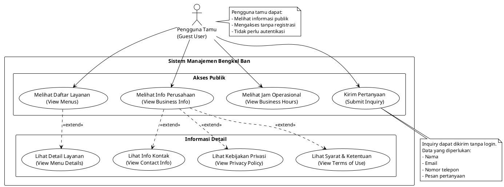

# Use Case Diagram - Guest User (Pengguna Tamu)

## Deskripsi Aktor
**Guest User** adalah pengunjung website yang belum melakukan registrasi atau login. Mereka memiliki akses terbatas hanya untuk melihat informasi publik dan mengirim pertanyaan.



## Daftar Use Case

### UC1: Melihat Daftar Layanan (View Menus)
**Deskripsi**: Pengguna dapat melihat semua layanan yang tersedia di bengkel ban

**Endpoint API**: 
- `GET /api/v1/public/menus`

**Fitur**:
- Melihat nama layanan
- Melihat harga layanan
- Melihat waktu yang dibutuhkan
- Melihat deskripsi layanan
- Support multi-bahasa (Indonesia/Jepang)

**Response Data**:
```json
{
  "id": 1,
  "name": "Ganti Ban",
  "description": "Layanan penggantian ban lengkap",
  "required_time": 30,
  "price": "150000.00",
  "is_active": true,
  "translations": {
    "en": {...},
    "ja": {...}
  }
}
```

---

### UC1A: Lihat Detail Layanan (View Menu Details)
**Deskripsi**: Melihat informasi lengkap dari satu layanan tertentu

**Endpoint API**:
- `GET /api/v1/public/menus/{id}`

**Fitur**:
- Detail lengkap layanan
- Foto layanan (jika ada)
- Informasi harga detail
- Estimasi waktu pengerjaan
- Slot waktu yang tersedia

---

### UC2: Melihat Info Perusahaan (View Business Info)
**Deskripsi**: Melihat informasi umum tentang perusahaan

**Endpoint API**:
- `GET /api/v1/public/business-settings`
- `GET /api/v1/public/business-settings/company-info`

**Informasi yang Ditampilkan**:
- Nama bengkel
- Alamat lengkap
- Informasi akses/lokasi
- Nomor telepon
- Email
- Website
- Deskripsi bengkel
- Logo/gambar utama

**Parameter**:
- `locale`: en atau ja (untuk konten multi-bahasa)

---

### UC2A: Lihat Info Kontak (View Contact Info)
**Deskripsi**: Melihat informasi kontak detail perusahaan

**Data Kontak**:
- Nomor telepon: 04-2937-5296
- Email: info@tirepro.co.id
- Website: https://fts.biz.id
- Alamat kantor

---

### UC2B: Lihat Kebijakan Privasi (View Privacy Policy)
**Deskripsi**: Membaca kebijakan privasi perusahaan

**Endpoint API**:
- `GET /api/v1/public/business-settings/terms-and-policies`

**Konten**:
- Kebijakan pengumpulan data
- Penggunaan data pribadi
- Keamanan informasi
- Hak pengguna

---

### UC2C: Lihat Syarat & Ketentuan (View Terms of Use)
**Deskripsi**: Membaca syarat dan ketentuan penggunaan layanan

**Konten**:
- Aturan penggunaan layanan
- Hak dan kewajiban pengguna
- Ketentuan pembatalan
- Kebijakan pengembalian dana

---

### UC3: Melihat Jam Operasional (View Business Hours)
**Deskripsi**: Melihat jadwal operasional bengkel

**Endpoint API**:
- `GET /api/v1/public/business-settings/business-hours`

**Data yang Ditampilkan**:
```json
{
  "business_hours": {
    "monday": { "open": "09:00", "close": "18:00" },
    "tuesday": { "open": "09:00", "close": "18:00" },
    "wednesday": { "open": "09:00", "close": "18:00" },
    "thursday": { "open": "09:00", "close": "18:00" },
    "friday": { "open": "09:00", "close": "18:00" },
    "saturday": { "open": "09:00", "close": "17:00" },
    "sunday": { "closed": true }
  }
}
```

**Informasi**:
- Jam buka/tutup setiap hari
- Hari libur
- Status hari ini (buka/tutup)

---

### UC4: Kirim Pertanyaan (Submit Inquiry)
**Deskripsi**: Mengirim pertanyaan atau permintaan informasi tanpa perlu login

**Endpoint API**:
- `POST /api/v1/public/inquiry`

**Data yang Diperlukan**:
```json
{
  "name": "Nama Lengkap",
  "email": "email@example.com",
  "phone_number": "081234567890",
  "subject": "Subjek Pertanyaan",
  "message": "Isi pertanyaan atau permintaan informasi"
}
```

**Proses**:
1. Pengguna mengisi form inquiry
2. Sistem memvalidasi data
3. Sistem menyimpan pertanyaan
4. Sistem mengirim notifikasi ke admin
5. Pengguna menerima konfirmasi email

**Validasi**:
- Nama: wajib diisi
- Email: wajib diisi, format email valid
- Phone: wajib diisi
- Message: wajib diisi, minimal 10 karakter

---

## Alur Interaksi Umum

### Skenario 1: Melihat Layanan dan Harga
```
1. Guest membuka halaman utama
2. Guest melihat daftar layanan (UC1)
3. Guest memilih layanan yang menarik
4. Guest melihat detail layanan (UC1A)
5. Guest melihat harga dan estimasi waktu
6. Guest melihat jam operasional (UC3)
```

### Skenario 2: Mengirim Pertanyaan
```
1. Guest membuka halaman kontak
2. Guest melihat info perusahaan (UC2)
3. Guest mengisi form inquiry (UC4)
4. Guest submit pertanyaan
5. Sistem mengirim email konfirmasi
6. Admin menerima notifikasi pertanyaan baru
```

### Skenario 3: Mencari Informasi Bengkel
```
1. Guest membuka halaman info perusahaan
2. Guest melihat info lengkap (UC2)
3. Guest membaca alamat (UC2A)
4. Guest melihat jam operasional (UC3)
5. Guest membaca kebijakan privasi (UC2B)
6. Guest membaca syarat & ketentuan (UC2C)
```

---

## Keterbatasan Guest User

❌ **Tidak Dapat**:
- Membuat reservasi
- Melihat riwayat reservasi
- Mengelola profil
- Menyimpan ban
- Melihat dashboard pribadi
- Mengakses fitur khusus member

✅ **Dapat**:
- Melihat semua informasi publik
- Mengirim pertanyaan
- Melihat harga layanan
- Melihat jam operasional
- Membaca kebijakan perusahaan

---

## Keuntungan untuk Guest User

1. **Akses Cepat**: Tidak perlu registrasi untuk melihat informasi
2. **Transparan**: Dapat melihat harga dan layanan sebelum daftar
3. **Komunikasi**: Dapat mengirim pertanyaan tanpa login
4. **Informasi Lengkap**: Akses ke semua informasi perusahaan

---

## Call-to-Action untuk Konversi

Setelah melihat informasi, Guest User didorong untuk:
1. **Register** → Menjadi Customer untuk booking
2. **Login** → Jika sudah punya akun
3. **Contact** → Kirim pertanyaan untuk info lebih lanjut

---

## Technical Notes

### API Base URL
```
https://tire.fts.biz.id/api/v1
```

### Public Endpoints (No Authentication)
- `/public/menus`
- `/public/menus/{id}`
- `/public/business-settings`
- `/public/business-settings/business-hours`
- `/public/business-settings/company-info`
- `/public/business-settings/terms-and-policies`
- `/public/inquiry`

### Request Headers
```
Content-Type: application/json
Accept: application/json
X-Locale: en|ja (optional)
```

### Response Format
```json
{
  "status": "success|error",
  "message": "Description",
  "data": {...}
}
```

---

## Kesimpulan

Guest User memiliki peran penting sebagai **entry point** sistem. Mereka dapat:
- Mengeksplorasi layanan tanpa komitmen
- Mendapatkan informasi lengkap tentang bengkel
- Menghubungi bengkel dengan mudah
- Memutuskan untuk mendaftar setelah puas dengan informasi

Pengalaman Guest User yang baik akan meningkatkan **konversi** menjadi Customer terdaftar.
